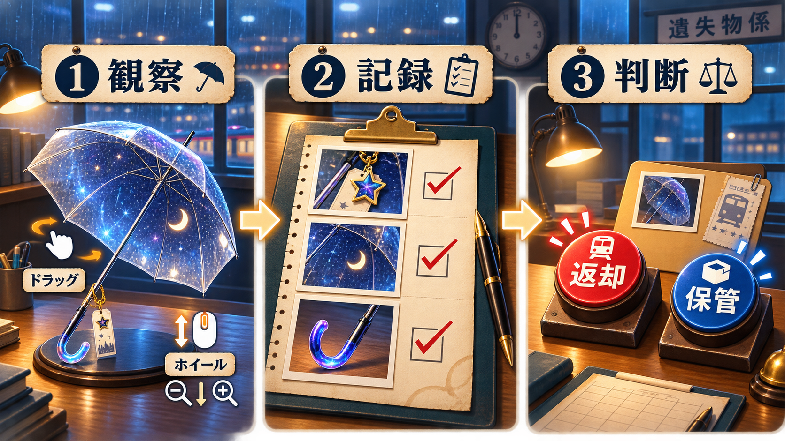

# 終電忘れ物センター / LostNight

終電後の忘れ物窓口を舞台にした、観察・推理・軽い怪異の短編ゲームです。

## モック

`Assets/Scenes/LostItemCenterMock.unity` を開いて再生してください。

## 遊び方

1. **観察・記録** — 忘れ物をドラッグで回転、マウスホイールで拡大し、光っている気になる箇所を直接クリックします。見つけた特徴は自動で調査メモへ記録されます。
3. **照合** — 記録した特徴と、申告者A・Bの証言を比べます。
4. **判断** — 持ち主が分かったら申告者を選んで「返却」、誰の物とも断定できなければ「保管」を選びます。
5. **次の案件** — 判定理由を確認して次へ進み、5案件の正解を目指します。

各案件の制限時間は45秒です。特徴を2件だけ記録して正解すると「迅速判定ボーナス」、残り秒数に応じて時間ボーナスを獲得できます。「返却」は選んだ申告者へ品物を渡す判断、「保管」は該当する持ち主がいないと判断して窓口に残す処理です。全5案件後に正解数・誤判断数・得点が表示され、全問正解でクリアとなります。

Unity 6000.3.18f1 / URP。UniTask、R3、VContainerを導入済みです。
